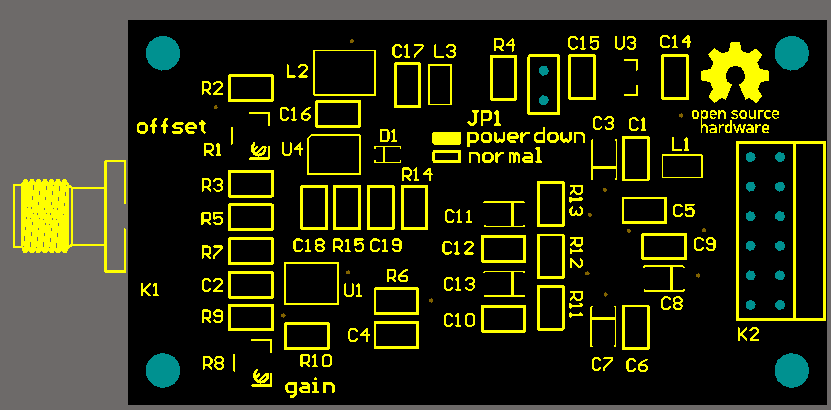

# A PMOD for ADC08200

Testing high speed ADCs easily.

* [Schematics](schematics.pdf)
* [BOM](bom.xls)

# License

Copyright Kelu124 (kelu124@gmail.com) 2020 

* The hardware is licensed under TAPR Open Hardware License (www.tapr.org/OHL) -- [TAPR_Open_Hardware_License_v1.0](/TAPR_Open_Hardware_License_v1.0.txt)
* The documentation is licensed under a [Creative Commons Attribution-ShareAlike 3.0 Unported License](http://creativecommons.org/licenses/by-sa/3.0/).

## Disclaimer

This project is distributed WITHOUT ANY EXPRESS OR IMPLIED WARRANTY, INCLUDING OF MERCHANTABILITY, SATISFACTORY QUALITY AND FITNESS FOR A PARTICULAR PURPOSE. 

